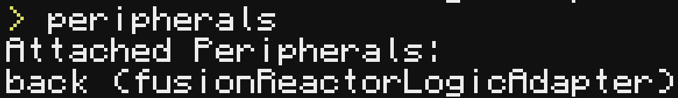

# What is this?
This is a LUA script that will figure out 80+ efficiency (the point where the error level start increasing) for a fusion reactor in [BFRM](https://modrinth.com/mod/better-fusion-reactor-for-mekanism), this does nothing (and will break) without that mod, nor do you need this anyway.

# How to setup
1. Make and add a fusion reactor logic adapter to your fusion reactor, then put a computer craft computer infront of it, if you did it correctly, if you run `peripherals` in the computer it should show `fusionReactorLogicAdapter` like in this screenshot (where its attached does not matter, it just needs to be there)

If it does not, then you have done something wrong.
2. Run `wget https://raw.githubusercontent.com/Soapy7261/FRRA/main/main.lua startup.lua` in the computer
3. Turn off and back on the computer and it *should* run the program, if there is any error, please [make an issue!](https://github.com/Soapy7261/FRRA/issues/new)
4. Enjoy your automated reactivity adjuster!

# What does the name mean?
FRRA is short for **F**usion **R**eactor **R**eactivity **A**djuster (I made it up)
